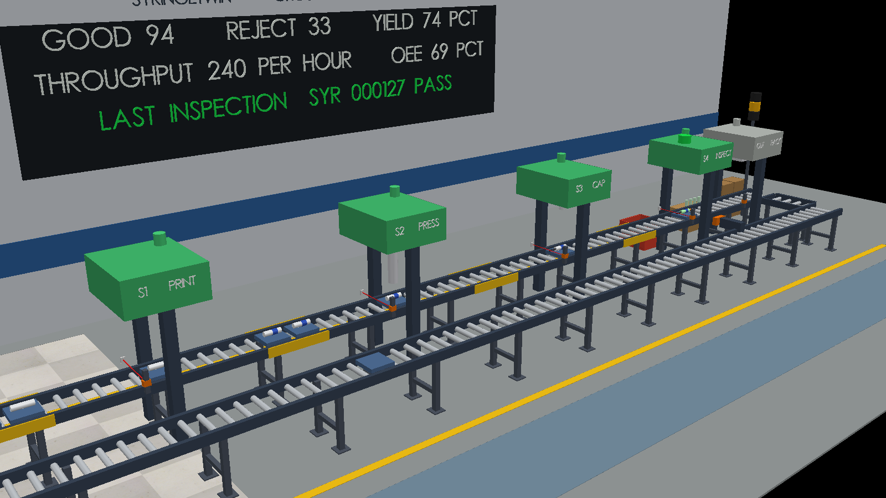
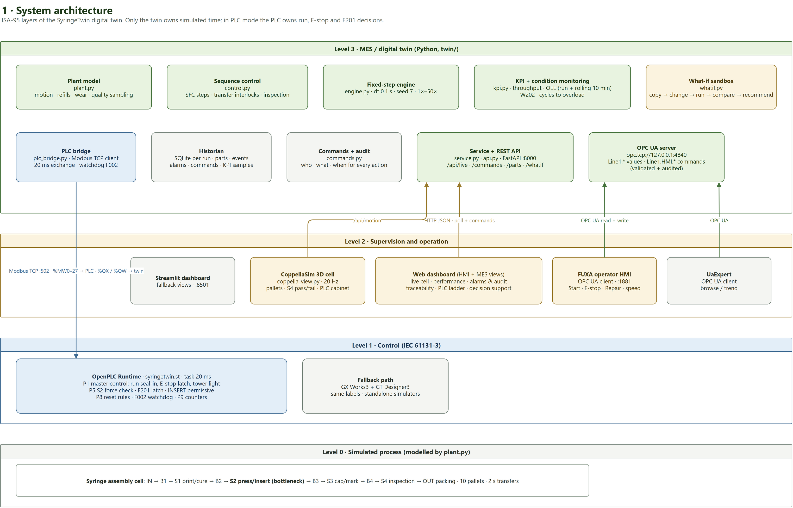
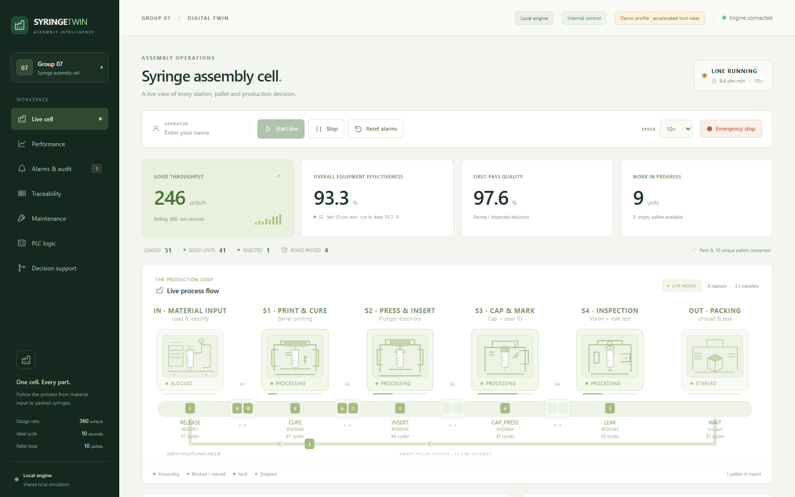
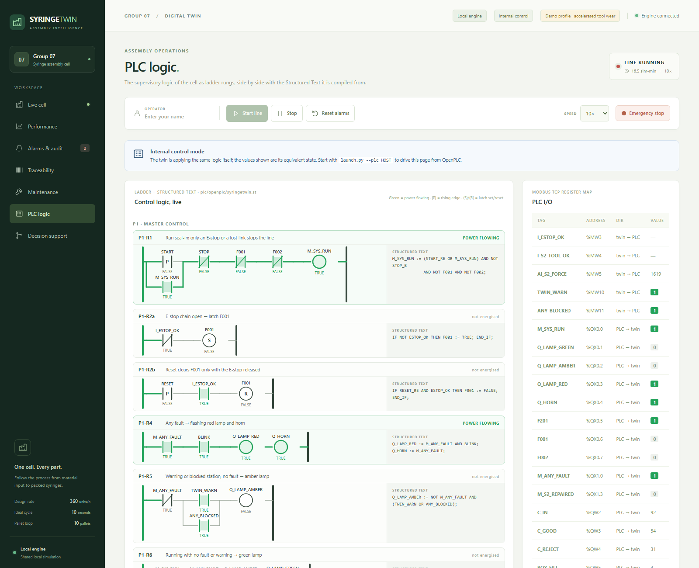
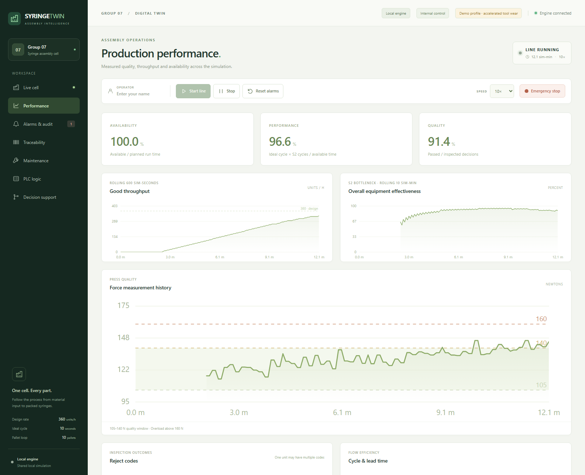
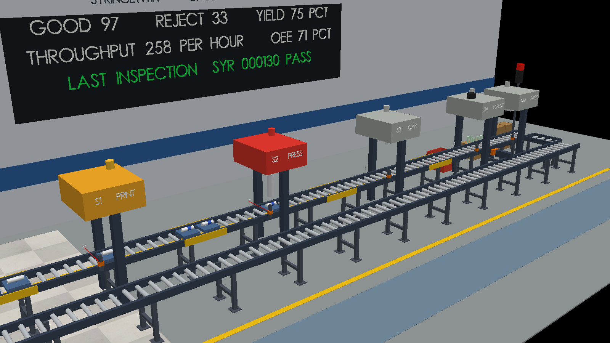
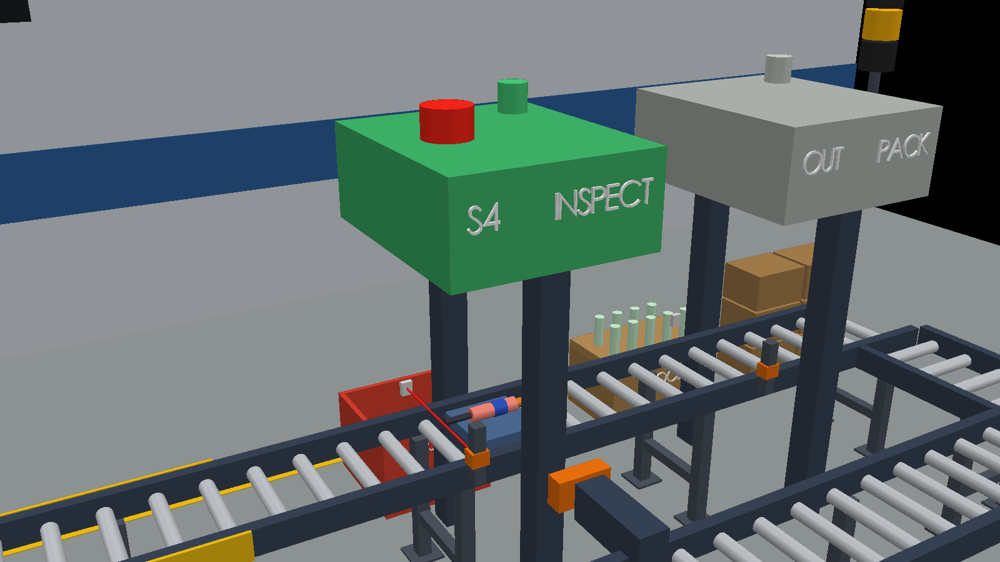
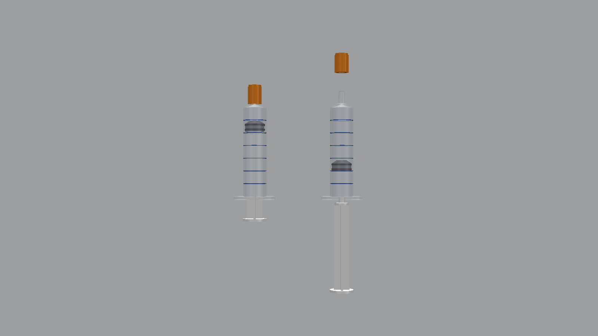

# SyringeTwin

**A digital twin of a smart syringe assembly cell, with a real PLC in the loop.**

SyringeTwin models a six-station production cell that assembles 5 mL three-part syringes, from loading the barrel to packing the finished part. A Python simulation is the single source of truth for the plant. Around it sits the same stack a real factory would use: an IEC 61131-3 PLC program running on OpenPLC over Modbus TCP, an OPC UA server feeding an industrial HMI, a live 3D view of the cell in CoppeliaSim, and a decision-support layer that answers "what happens if we change this?" before anyone touches the line.



---

## Contents

- [What it does](#what-it-does)
- [The process](#the-process)
- [Architecture](#architecture)
- [The core story: tool wear to overload](#the-core-story-tool-wear-to-overload)
- [Decision support (what-if)](#decision-support-what-if)
- [Control layer: OpenPLC](#control-layer-openplc)
- [Operator interfaces](#operator-interfaces)
- [3D cell and CAD](#3d-cell-and-cad)
- [Validation](#validation)
- [Getting started](#getting-started)
- [Repository layout](#repository-layout)
- [Technology](#technology)
- [Scope and limitations](#scope-and-limitations)

---

## What it does

| Capability | What you see |
|---|---|
| **Live process model** | Ten RFID-tagged pallets circulate through six stations and four FIFO buffers. Each station runs its own step sequence (SFC), with transfer interlocks, refills, tool wear and quality noise. |
| **Fault behaviour** | An S2 press overload (F201) is a *local* fault: S2 stops, upstream stations block, downstream stations starve, and the rest of the line keeps running. The same thing happens on the PLC, the dashboard, the HMI and in 3D. |
| **Condition monitoring** | Press force is trended for every cycle. A warning (W202) is raised from the smoothed force and the predicted cycles left before overload, well before the trip. |
| **Decision support** | A what-if sandbox copies the live line, applies a change such as a tool-change policy or a cycle-time change, runs it forward over several random seeds, and recommends an option only when the gain is consistent across them. |
| **Real control logic** | A Structured Text program on OpenPLC owns run permission, the E-stop latch, F201 detection, alarm reset rules, counters and a link watchdog. The dashboard draws the same logic as live ladder rungs. |
| **Industrial interfaces** | Modbus TCP to the PLC; OPC UA (`ns=2;s=Line1.*`) for SCADA/HMI clients; a FUXA operator HMI whose buttons go through the same validated, audited command path as the dashboard. |
| **Traceability** | Every serial keeps its measurements, decisions and event history. Every operator action is recorded with who, what and when. History is stored in SQLite per run. |
| **KPIs** | Throughput, OEE (cumulative and rolling 10 minutes), first-pass yield, lead time, WIP and a reject Pareto by reason code. |

---

## The process

The product is a 5 mL three-part disposable syringe made of a barrel, a plunger with a rubber stopper, and a tip cap. Each pallet carries one syringe through the cell:

```
 IN ──► B1 ──► S1 ──► B2 ──► S2 ──► B3 ──► S3 ──► B4 ──► S4 ──► OUT
 load         print         press         cap           inspect      pack
 barrel       + UV cure     + insert      + laser mark  vision+leak  boxes of 10
   ▲                                                       │ reject bin
   └─────────────────── empty pallet return (10 s) ─────────┘
```

| Station | Steps (simulation seconds) | Cycle incl. 2 s transfer |
|---|---|---|
| IN · Material input | PICK 1.5 · PLACE 1.0 · WRITE_ID 0.5 | 5 s |
| S1 · Print and cure | CLAMP 0.5 · PRINT 2.0 · CURE 3.0 · UNCLAMP 0.5 | 8 s |
| **S2 · Press and insert** | PRESS 2.0 · INSERT 3.0 · RETRACT 1.5 · RELEASE 0.5 · HANDLING 1.0 | **10 s (bottleneck, 360 units/h)** |
| S3 · Cap and mark | CAP_PRESS 1.5 · LASER 2.5 · VERIFY 1.0 | 7 s |
| S4 · Inspection | VISION 1.0 · LEAK 3.0 · DECIDE 0.5 · DIVERT 0.5 | 7 s |
| OUT · Packing | UNLOAD 1.0 | 3 s |

S4 decides PASS or FAIL from the part's measured history. The reject codes are:

| Code | Rule |
|---|---|
| R1 | Print offset > 0.15 mm |
| R2 | Press force outside 105–140 N |
| R3 | Leak rate > 5 Pa/s |
| R4 | Cap missing |
| R5 | Laser mark grade D |

All timing, limits and probabilities live in [`config/line.yaml`](config/line.yaml).

---

## Architecture



The twin owns simulated time; nothing else advances it. It runs a fixed-step engine (dt 0.1 s, seed 7, 1× to 50× speed) and publishes one consistent snapshot per step to every consumer:

- **Level 3, MES and digital twin** (`twin/`): plant model, sequence control, KPIs, historian, command audit, what-if sandbox, REST API (FastAPI on `:8000`) and OPC UA server (`:4840`).
- **Level 2, supervision and operation**: the web dashboard, the FUXA HMI, the CoppeliaSim 3D cell, UaExpert, and a Streamlit fallback.
- **Level 1, control**: OpenPLC Runtime running [`plc/openplc/syringetwin.st`](plc/openplc/syringetwin.st) with a 20 ms task.
- **Level 0, process**: the simulated cell itself.

In **PLC mode** the twin hands the run, E-stop and F201 decisions to the PLC and waits for its verdicts. In **internal mode** the twin applies the same logic itself, so everything also works without a PLC.

More diagrams are in [`docs/diagrams/`](docs/diagrams): process flow, data architecture, F201 cause and effect, and the what-if loop. Each is an editable `.drawio` file with a PNG export.

---

## The core story: tool wear to overload

The S2 press tool wears with every cycle, and press force rises with wear. This one physical cause drives most of what the twin demonstrates:

1. **Drift.** Force climbs from about 120 N towards the 140 N quality limit. The force chart shows it live.
2. **Early warning (W202).** The 5-press mean exceeds 135 N, or fewer than 60 cycles are predicted before overload. Maintenance gets advance notice.
3. **Quality loss.** Parts pressed outside the window fail at S4 with R2, and usually R3 as well, because over-pressed parts also leak.
4. **Overload (F201).** One press exceeds 160 N. S2 latches the fault, the tower light turns red, B2 fills and blocks S1 and IN, and S3 onwards starves.
5. **Recovery.** Repair takes 90 s. Reset is refused until the repair is complete. S2 then resumes at RETRACT, and the affected part is rejected with its overload event still on its trace.

The `demo` profile speeds this up for presentations. W202 appears after about 410 simulation seconds and F201 after about 870, which is roughly 90 seconds of real time at 10× speed.



---

## Decision support (what-if)

The Decision support page answers operational questions without disturbing the running line:

1. **Copy** the live state, deep-copied and never modified.
2. **Change** one thing: the maintenance policy or a station's cycle time.
3. **Run** every option forward over the same horizon (30, 60 or 120 minutes) using common random numbers, across 1, 3 or 5 seeds.
4. **Compare** good units per hour, F201 count, rejects and downtime.
5. **Recommend** an option only if it gains at least 2 % and wins in at least 4 of 5 seeds; otherwise keep the current setting.

Results measured by the validation suite (seed 7):

| Question | Result |
|---|---|
| Keep running, change the tool now, or change on condition? | Condition-based wins: **337 good/h** vs 217 (keep running) and 234 (change now). F201 drops from 2 to 0. Wins 5 of 5 seeds. |
| Speed up S1 curing (3 s to 2 s)? | **No gain** (+0.0 %). S1 is not the bottleneck, so the recommendation is to keep the current setting. |
| Speed up S2 insertion (3 s to 0.5 s)? | **+27.7 %**. Design capacity rises from 360 to 450/h, and the bottleneck moves from S2 to S1. |
| Does the "keep running" forecast match reality? | Forecast F201 at 229.2 s; the live line tripped at 229.2 s. |

---

## Control layer: OpenPLC

The PLC program is deliberately small but real. It is IEC 61131-3 Structured Text, compiled by OpenPLC's matiec toolchain and run on OpenPLC Runtime v3:

| Block | Responsibility |
|---|---|
| **P1** master control | Run seal-in (only E-stop or link loss stops the line), E-stop latch F001, tower light and horn |
| **P5** S2 force monitoring | Evaluates every press sample, latches F201 above 160 N, returns a verdict that S2 must receive before INSERT |
| **P8** alarms and recovery | Reset rules (F201 only after repair, F001 only with the E-stop released) and an F002 link watchdog |
| **P9** counters | Parts in, good and reject, box fill and boxes packed |

The twin and the PLC exchange 28 holding registers and a set of coils over Modbus TCP every 20 ms. Edge events are carried as sequence numbers, not pulses, so nothing is lost between scans. If the PLC stops, the twin raises **F002** within a second and halts the line, which shows the PLC really is in the loop.

The **PLC logic** page draws 16 ladder rungs equivalent to the ST code, each beside its Structured Text, energised live from the PLC's coils and registers (or from the twin's equivalent state in internal mode).



| Document | Purpose |
|---|---|
| [`docs/plc/PLC_SPEC.md`](docs/plc/PLC_SPEC.md) | Program organisation, rung-by-rung logic, twin-side contract, verification cases |
| [`docs/plc/tag_dictionary.csv`](docs/plc/tag_dictionary.csv) | Every signal with its Modbus address, OPC UA node ID and HMI use |
| [`docs/plc/UBUNTU_RUNBOOK.md`](docs/plc/UBUNTU_RUNBOOK.md) | Installing OpenPLC, loading the program, acceptance tests and the full demo |

---

## Operator interfaces

**Web dashboard** (`http://127.0.0.1:8000`) has seven workspaces: live cell, performance, alarms and audit, traceability, maintenance, PLC logic and decision support.

**FUXA HMI** (`http://127.0.0.1:1881`) is a full-screen operator panel built in an open-source industrial SCADA package. It connects as an OPC UA client and shows:

- Station states, buffer levels, production KPIs and S2 force and tool health
- Alarm lamps and the last inspection result

Its buttons are Start, Stop, Reset, Repair, Tool change, Inject F201, E-stop and speed. The HMI writes to the `Line1.HMI.*` command nodes; the twin validates each request, records it in the audit trail as *HMI (OPC UA)*, and reports the outcome back to the screen. The project file is [`hmi/syringetwin_hmi.json`](hmi/syringetwin_hmi.json).

**OPC UA**: any client, for example UaExpert, can browse and trend the `Line1.*` namespace at `opc.tcp://127.0.0.1:4840/syringetwin/`.



---

## 3D cell and CAD

`tools/coppelia_view.py` builds a Factory I/O-style cell in CoppeliaSim. It has roller conveyors, photo-eyes, machine frames, a control panel, a stack light, a PLC cabinet with live LEDs, and a scoreboard. It mirrors the twin at about 20 Hz:

- Pallets glide between stations, and each syringe gains its parts as it travels.
- The press ram strokes, and the housings take each machine's state colour.
- S4 lights PASS or FAIL. A pusher diverts rejects into the bin; good parts fill the packing box.

<table>
<tr>
<td></td>
<td></td>
</tr>
<tr>
<td align="center">F201 at S2: upstream blocks, downstream starves</td>
<td align="center">S4 inspection failure and diversion</td>
</tr>
</table>

The product and its pallet fixture are modelled parametrically in CadQuery (ISO 7886-1 style 5 mL syringe, 6 % luer taper). STEP and STL files for every part, plus syringe and pallet assemblies, are in [`cad/`](cad) and open directly in Fusion 360 or any CAD tool.

<p align="center"></p>

---

## Validation

The model is checked against its own rules and against queueing theory, and every number is measured, not asserted.

- **[Validation test matrix](docs/evidence/test_matrix.md): 36 of 36 automated cases pass.** They cover start and stop, E-stop, F201 and its propagation, recovery, inspection correctness, part conservation on every tick, FIFO order, refills, planned tool changes, design rate, Little's Law, determinism, what-if behaviour and PLC mode.
- **Design rate**: with wear and noise switched off, the line produces exactly 360 good units per hour.
- **Little's Law**: WIP equals throughput × lead time on the same window (8.99 vs 8.99).
- **Real PLC acceptance: 13 of 13 cases pass on OpenPLC Runtime v3 (Ubuntu)**, recorded in [`plc_manual_results.json`](docs/evidence/plc_manual_results.json) and in the test matrix. `tools/plc_acceptance.py` runs PLC-01 to PLC-13 against the running PLC, covering seal-in, E-stop latching, F201 and its injection, reset rules, the watchdog and the counters.
- **Unit and integration tests**: 88 pytest tests, including a software PLC that runs the ST logic and a Modbus server double for the bridge.
- **CI**: GitHub Actions on Ubuntu and Windows (Python 3.11) runs the suite and a UI smoke test on every push.

```bash
python -m pytest -q
python tools/validation_matrix.py      # regenerates docs/evidence/test_matrix.md
```

---

## Getting started

Python 3.11 or later is required.

### Quick start (Windows, no PLC)

1. Double-click `Start_Windows.bat`. It creates `.venv` on first run and opens the dashboard at http://127.0.0.1:8000.
2. Enter an operator name, choose a speed, and press **Start line**.
3. `Stop_Windows.bat` shuts everything down.

### Command line (any OS)

```bash
python tools/setup_env.py --dev
.venv/bin/python launch.py --profile demo --opcua           # Windows: .venv\Scripts\python.exe
```

| Flag | Effect |
|---|---|
| `--profile demo` | Accelerated tool wear, so W202 and F201 appear within minutes |
| `--opcua` | Starts the OPC UA server for FUXA or UaExpert |
| `--plc HOST[:PORT]` | PLC mode: links the twin to OpenPLC over Modbus TCP |
| `--background` / `--stop` | Runs as a managed background session |

To add the 3D view, start CoppeliaSim Edu 4.10 and run `python tools/coppelia_view.py --launch`.

### Full demo with the real PLC (Ubuntu)

Everything runs on one Ubuntu machine: OpenPLC, the twin, CoppeliaSim and the FUXA HMI.

```bash
bash tools/ubuntu_setup.sh       # once: OpenPLC Runtime v3 and the Python environment
bash tools/ubuntu_coppelia.sh    # once: CoppeliaSim Edu 4.10
bash tools/ubuntu_hmi.sh         # once: Node.js and FUXA
bash tools/ubuntu_demo.sh        # each demo: twin + 3D cell + HMI, linked to OpenPLC
```

Load `plc/openplc/syringetwin.st` into OpenPLC and start it first. The [Ubuntu runbook](docs/plc/UBUNTU_RUNBOOK.md) walks through each step and includes a demo script.

---

## Repository layout

```
twin/              Digital twin: engine, plant model, control, KPIs, what-if, PLC bridge, OPC UA, API
web/               Web dashboard (HTML/JS) including the live ladder view
plc/openplc/       Structured Text programs for OpenPLC (syringetwin.st, connection spike)
hmi/               FUXA operator HMI project
config/            Line parameters (line.yaml) and the demo profile
cad/               Syringe and pallet CAD: STEP, STL, drawings, renders
tools/             3D viewer, PLC probe and acceptance test, validation matrix, setup scripts
tests/             pytest suite, software PLC and Modbus doubles, UI smoke test
docs/diagrams/     Architecture and process diagrams (draw.io + PNG)
docs/plc/          PLC specification, tag dictionary, Ubuntu runbook
docs/evidence/     Test matrix, measurements and screenshots
docs/specification/ Project brief and design decisions (D1–D13)
```

---

## Technology

| Layer | Tools |
|---|---|
| Simulation and MES | Python 3.11+, NumPy, PyYAML, FastAPI, SQLite |
| Control | OpenPLC Runtime v3, IEC 61131-3 Structured Text, Modbus TCP (pymodbus) |
| Interoperability | OPC UA (asyncua), UaExpert |
| HMI and dashboards | FUXA, vanilla JS web dashboard, Streamlit |
| 3D visualisation | CoppeliaSim Edu 4.10 (ZeroMQ remote API) |
| CAD | CadQuery (STEP/STL), Fusion 360 compatible |
| Engineering docs | draw.io |
| Quality | pytest, GitHub Actions (Ubuntu and Windows) |

---

## Scope and limitations

- SyringeTwin is a teaching and demonstration twin. Dimensions, timings and quality distributions are representative, not taken from a validated production line, and nothing here constitutes medical-device validation.
- The plant is simulated; there is no physical hardware. The PLC is real software (OpenPLC) controlling simulated I/O.
- The OPC UA server and Modbus link are bound to localhost without security. They are a demonstration interface, not a plant network configuration.
- Each restart begins a fresh, deterministic run (seed 7); earlier runs remain on disk as separate databases.

Design choices and their rationale (local versus global faults, transfer semantics, what-if fairness, the PLC split, the HMI command path) are recorded in [`docs/specification/DECISIONS.md`](docs/specification/DECISIONS.md).

---

Developed by Group 07 for the *Digital Twin of a Smart Factory* project.
